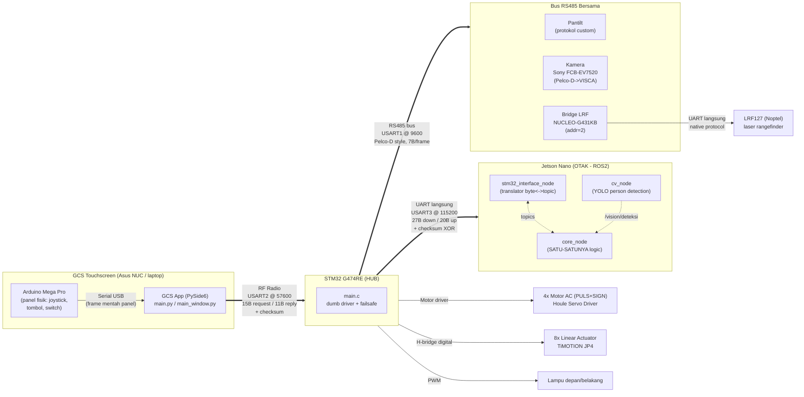
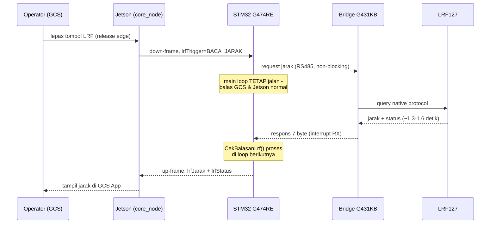
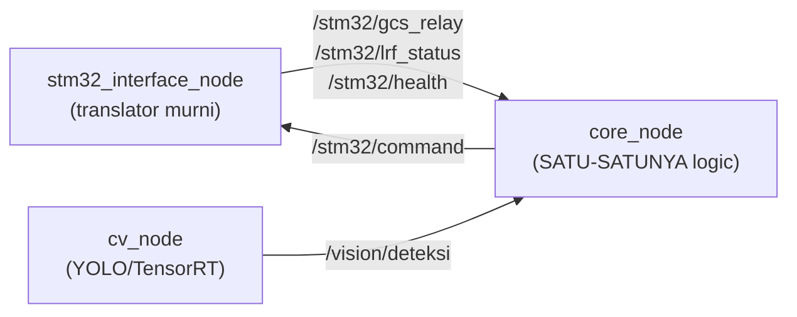

# UGV Lidikzi 2

Sistem kendali *Unmanned Ground Vehicle* (UGV) remote-control untuk TNI Zeni AD. Robot dikendalikan operator lewat GCS (Ground Control Station) touchscreen yang terhubung ke robot lewat radio RF, dengan STM32 sebagai "hub" hardware dan Jetson Nano (ROS2) sebagai "otak" pengambil keputusan.

Dokumentasi ini mencakup arsitektur, protokol komunikasi, cara build/flash/jalanin tiap komponen, dan tools testing yang tersedia.

---

## Daftar Isi

1. [Ringkasan Fitur](#ringkasan-fitur)
2. [Arsitektur Sistem](#arsitektur-sistem)
3. [Struktur Repository](#struktur-repository)
4. [Komponen Hardware](#komponen-hardware)
5. [Protokol Komunikasi](#protokol-komunikasi)
6. [Firmware STM32](#firmware-stm32)
7. [ROS2 (Jetson Nano)](#ros2-jetson-nano)
8. [GCS App (Ground Control Station)](#gcs-app-ground-control-station)
9. [Cara Build & Flash STM32](#cara-build--flash-stm32)
10. [Cara Jalankan ROS2](#cara-jalankan-ros2)
11. [Cara Jalankan GCS App](#cara-jalankan-gcs-app)
12. [Tools Testing](#tools-testing)
13. [Isu & Catatan Penting](#isu--catatan-penting)

---

## Ringkasan Fitur

- Kendali gerak (drive + steering) lewat joystick analog di panel GCS
- 8 actuator linear individual (steering depan/belakang kiri-kanan, body depan/belakang kiri-kanan) - bisa dikalibrasi satu-satu, atau digerakkan berpasangan per-axle buat kenyamanan
- Pan-tilt kamera + zoom (Sony FCB-EV7520 lewat modul joystick/RS485)
- Laser Range Finder (Noptel LRF127) - baca jarak on-demand + pointer ON/OFF
- Lampu depan (dimmable) + lampu belakang (mati/nyala/kedip, otomatis kedip pas mundur)
- Slip ring power switch (buat pantilt+kamera+LRF yang duduk di dudukan berputar)
- Mode kalibrasi actuator (Fully Extend + Fully Left, dengan safety timeout)
- Deteksi orang otomatis (YOLO/TensorRT) buat overlay video, mode manual/auto
- E-STOP manual + beberapa lapis failsafe otomatis (link timeout, auto-estop kalau telemetry putus, dll - lihat [Isu & Catatan Penting](#isu--catatan-penting))

---

## Arsitektur Sistem

Prinsip desain: **"dumb driver, smart brain"** - STM32 gak pernah mutusin apa-apa sendiri (kecuali failsafe darurat), semua logic ada di `core_node.py` (Jetson). STM32 cuma nge-apply command final dan me-relay data mentah.



**Kenapa arsitektur ini:** desain awal sempat coba SPI dan I2C langsung ke Jetson, gagal secara elektrik. Mentor minta USB Jetson jangan dipakai buat link real-time (cuma boleh buat flashing sesekali) - jadi semua link fisik (RF, RS485) dipegang STM32, Jetson cuma dapat 1 link UART biasa ke STM32.

Diagram block versi visual (drawio) juga ada di [`Rapih/Dokumentasi/Block Diagram.png`](Rapih/Dokumentasi/Block%20Diagram.png).

---

## Struktur Repository

Project ini punya folder legacy dari iterasi-iterasi sebelumnya. **`Rapih/`** (+ folder root `ROS2/` dan `Testcode/`) adalah struktur yang AKTIF dipakai sekarang - selain itu dianggap arsip/referensi lama.

```
ugv-robot/
├── Rapih/                          # <-- SUMBER UTAMA (kode yang aktif dipakai)
│   ├── Code/
│   │   ├── NucleoG474RE/           # Firmware STM32 G474RE (MASTER/HUB) - STM32CubeIDE project
│   │   ├── NucleoG474RE - Copy/    # Duplikat buat bench-test isolasi (lihat catatan di bawah)
│   │   ├── NucleoG431KB/           # Firmware STM32 G431KB (BRIDGE LRF) - STM32CubeIDE project
│   │   ├── ArduinoMegaPro/         # Firmware panel GCS fisik (joystick+tombol -> serial)
│   │   ├── Asus NUC/               # GCS App (PySide6, Python) - jalan di laptop/NUC
│   │   └── STMF103/                # Firmware lama (referensi, sebelum migrasi ke G474RE)
│   ├── Datasheet/                  # Datasheet semua komponen (LRF127, servo driver, actuator, dst)
│   ├── Dokumentasi/                # Block diagram, dokumentasi lama
│   ├── Hardware/                   # Layout panel GCS, gambar rangka
│   ├── ROS2/ros2_ws/               # ROS2 workspace TERBANGUN (build/install/log + src)
│   ├── Schematic/                  # Skematik KiCad/EasyEDA board custom STM32G474
│   └── Test Code/                  # Kumpulan skrip tes Python/Arduino (histori lengkap, banyak versi lama)
├── ROS2/                           # Salinan KERJA node ROS2 (yang paling sering diedit) - lihat catatan sinkronisasi
│   ├── core_node.py                # SATU-SATUNYA tempat logic/keputusan
│   ├── stm32_interface_node.py     # Translator byte<->topic ke/dari STM32
│   ├── cv_node.py                  # Deteksi orang (YOLO/TensorRT)
│   └── *.msg                       # Definisi message ROS2 custom
├── Testcode/                       # Skrip test/loopback terbaru (RS485, USB-TTL, dsb)
├── dokumentasi/                    # Brief arsitektur (ROS2_BRIEF.md) + panduan setup ROS2 di Jetson
└── (GKDIPAKE/, codeModeROS/, gcs_app/, jetson/, lidikzi_2/, reference/,
     serialControlApp/, wiring/, KiCad/, STM32Cube/, dokumentasi/Finished/…)  # ARSIP/legacy, gak dipakai lagi
```

> **Catatan sinkronisasi ROS2**: folder `ROS2/` di root itu salinan kerja yang paling sering diedit (termasuk fix-fix terbaru), sedangkan `Rapih/ROS2/ros2_ws/src/ugv_robot/ugv_robot/` adalah workspace yang beneran di-`colcon build`. **Keduanya bisa GAK SINKRON** - sebelum deploy ke Jetson, pastikan file di `ros2_ws/src` udah disalin dari `ROS2/` root yang terbaru.

> **Catatan `NucleoG474RE - Copy`**: ini bukan firmware produksi - project duplikat yang dipakai buat isolasi bug (bench-test pulsa motor AC tanpa RS485/failsafe/dll). Jangan di-flash ke robot asli.

---

## Komponen Hardware

| Komponen | Model | Peran |
|---|---|---|
| MCU Hub | STM32G474RE (custom board berbasis Nucleo) | Master - kendaliin motor, actuator, lampu, relay semua link |
| MCU Bridge LRF | STM32G431KB (Nucleo) | Translator LRF127 <-> bus RS485 |
| Compute utama | NVIDIA Jetson Nano 4GB (JetPack 4.x) | Jalanin ROS2 (logic + computer vision) |
| Panel GCS | Arduino Mega 2560 Pro | Baca joystick analog + tombol panel fisik |
| Laptop/GCS | Asus NUC / laptop Windows | Jalanin GCS App (PySide6) |
| Motor drive | 4x AC Servo Motor + Houle "HK Series" Servo Driver | Gerak maju/mundur (PULS+SIGN interface) |
| Actuator steering/body | 8x TiMOTION JP4 Linear Actuator | Steering (4x) + naik-turun body (4x) |
| Laser Rangefinder | Noptel LRF127 | Ukur jarak target |
| Kamera | Sony FCB-EV7520 (+ modul joystick/RS485-VISCA) | Video + zoom, kontrol Pelco-D |
| Pan-Tilt | Custom (protokol reverse-engineered) | Gerak kamera+LRF |
| Video link | RC832 Video Receiver | Terima video analog di sisi GCS |
| Radio | Modul RF custom (57600 baud) | Link GCS <-> STM32 |

Semua datasheet ada di [`Rapih/Datasheet/`](Rapih/Datasheet/).

---

## Protokol Komunikasi

Ada 4 link fisik terpisah, semua checksummed:

### 1. GCS ↔ STM32 (Radio RF, USART2 @ 57600 baud)

Request-response, GCS yang mulai duluan (~20Hz).

**GCS → STM32, 15 byte** (`"=BbbbbbBBBBbBbBB"`):

| Field | Tipe | Keterangan |
|---|---|---|
| `estop` | uint8 | 0/1 |
| `xJoy1`, `yJoy1` | int8 | Joystick analog utama (steer/speed), -100..100 |
| `xJoy2`, `yJoy2` | int8 | Tombol digital pantilt, -100/0/100 |
| `zoom` | int8 | -1/0/1 |
| `lrf` | uint8 | Trigger hold-to-laser / release-to-read |
| `fLamp`, `bLamp` | uint8 | Brightness/mode lampu |
| `slipRing` | uint8 | 0/1 |
| `bodyUpDown` | int8 | Raise/Lower body (tombol fisik) |
| `motorIndividualId` | uint8 | 0=normal, 1-10=override individual/berpasangan (lihat `motor_linear_dialog.py`) |
| `motorIndividualArah` | int8 | -1/0/1 |
| `kalibrasi` | uint8 | 0/1 |
| `mode` | uint8 | 0=manual, 1=auto (gerbang CV) |

**STM32 → GCS, 11 byte**: `[0xA5][stm32_status][lrf_status][lrf_lsb][lrf_msb][box_terdeteksi][box_x][box_y][box_w][box_h][checksum XOR]`

### 2. Jetson ↔ STM32 (UART langsung, USART3 @ 115200 baud)

Jetson yang inisiatif tiap siklus (~10-20Hz), synchronous write-then-read. Reception di STM32 pakai **hitung-byte-manual** (bukan idle-line), karena link ini sensitif ke jeda antar-byte dari buffering OS/USB Jetson.

**Jetson → STM32 (down), 27 byte**: `speed(1) + act[8](8) + fLamp,bLamp,bLampMode(3) + pantiltH,pantiltV,zoom(3) + slipRing,lrfTrigger(2) + gcsReply x4(4) + gcsReplyBox x5(5) + checksum(1)`

**STM32 → Jetson (up), 20 byte**: 15 byte relay GCS mentah + `lrfLsb,lrfMsb,lrfStatus,stm32Status(4)` + `checksum(1)`

Checksum kedua arah: XOR semua byte data (belum termasuk byte checksum-nya sendiri).

### 3. STM32 ↔ Bus RS485 (USART1 @ 9600 baud)

Frame custom mirip Pelco-D, 7 byte: `[0xFF][alamat][cmd1][cmd2][data1][data2][checksum]` (checksum = additive sum, khusus pantilt payload 0xFF diabaikan dari sum). Alamat: kamera=1, bridge LRF=2, pantilt gak validasi alamat (payload beda struktur).

Baca jarak LRF & set pointer **non-blocking (async)** di firmware - request dikirim, main loop STM32 TETAP jalan normal, balasan dicek lewat interrupt + timeout (dulu blocking, bikin STM32 "beku" 1.3-2.3 detik tiap kali LRF diminta - lihat [Isu & Catatan Penting](#isu--catatan-penting)).

### 4. Bridge (G431KB) ↔ LRF127

Protokol native LRF127 (lihat [`Rapih/Datasheet/LRF127 Interface Control.pdf`](Rapih/Datasheet/LRF127%20Interface%20Control.pdf)), mode SMM (~1.3 detik nominal, +300ms kemungkinan cuaca buruk). Bridge translate hasilnya jadi frame Pelco-D-style 7-byte buat dikirim balik ke bus.

### Sequence: baca jarak LRF (async)



---

## Firmware STM32

### G474RE (`Rapih/Code/NucleoG474RE/Core/Src/main.c`) - Master/Hub

- Pegang LANGSUNG: radio GCS (USART2), bus RS485 (USART1), semua motor/actuator/lampu, link Jetson (USART3), debug (LPUART1 @ 209700, numpang ST-LINK VCP di PA2/PA3).
- **2 failsafe independen**: `JETSON_LINK_TIMEOUT_MS` (500ms) dan `GCS_LINK_TIMEOUT_MS` (1500ms, sengaja lebih longgar - radio RF normalnya miss ~75-80% per percobaan) - kalau salah satu link mati total, paksa stop motor/actuator.
- Anti-glitch: `setPulseFreq()` cuma di-re-apply kalau nilai speed BERUBAH (hindari reprogram timer redundan ~20Hz), debounce 1-frame khusus transisi speed->0.
- Motor AC: `setMotor()` -> Timer Output-Compare Toggle mode (`TIM3/TIM4/TIM8/TIM15`), `freqHz = |speed| * FREQ_PER_RPM(50)`, clock 170MHz.
- Actuator: `SetActuator()` - 2 pin digital (RPWM/LPWM) per actuator, gak ada feedback posisi (jog control murni).

### G431KB (`Rapih/Code/NucleoG431KB/Core/Src/main.c`) - Bridge LRF

- Address 2 di bus RS485 bersama.
- Translate command Pelco-D-style dari bus -> protokol native LRF127 (USART2-nya sendiri, terpisah dari bus) -> bungkus hasil balik jadi Pelco-D-style.
- `LRF_FlushRx()` sebelum tiap command - cegah bug "sekali gagal, gagal selamanya" dari byte basi nyangkut di buffer.

### Arduino Mega Pro (`Rapih/Code/ArduinoMegaPro/ArduinoMegaPro.ino`) - Panel GCS

Baca joystick analog (averaging + exponential smoothing + deadzone) dan tombol panel, kirim frame mentah 20Hz ke GCS App lewat USB serial.

---

## ROS2 (Jetson Nano)

3 node, pembagian tugas TEGAS - **cuma `core_node` yang boleh punya logic/keputusan**.



| Node | Boleh logic? | Tugas |
|---|---|---|
| `stm32_interface_node.py` | Tidak | Baca/tulis serial ke STM32, publish data mentah, subscribe command final |
| `cv_node.py` | Tidak | Deteksi YOLO dari kamera RTSP, publish posisi box "person" paling confident |
| `core_node.py` | **Ya** | Olah semua data mentah jadi command final |

Detail lengkap mapping field-per-field ada di [`dokumentasi/ROS2_BRIEF.md`](dokumentasi/ROS2_BRIEF.md) - baca ini dulu sebelum ubah node manapun.

**Jetson Nano 4GB, bukan Orin Nano** - JetPack 4.x = Ubuntu 18.04, jadi ROS2 yang dipakai **Foxy** (bukan Humble, butuh 22.04).

---

## GCS App (Ground Control Station)

`Rapih/Code/Asus NUC/`, PySide6. Entry point `main.py`.

- `main_window.py` - window utama: panel Connection (GCS Board/Telemetry/Controller), Control Panel (lampu, slip ring, body), Camera Viewer, dialog Motor Linear Individual.
- `motor_linear_dialog.py` - kontrol per-actuator (Steer/Body, masing-masing Extend/Retract) + mode berpasangan (Steer Together).
- `serial_workers.py` - 2 thread terpisah: `ArduinoReader` (baca panel fisik) dan `RFLink` (kirim/terima ke STM32, 20Hz).
- `camera_viewer.py` - render video RTSP/analog + overlay box deteksi.
- Auto E-STOP kalau app ditutup ATAU telemetry gak respons (link masih kirim command tapi gak ada balasan) - lihat [Isu & Catatan Penting](#isu--catatan-penting).

---

## Cara Build & Flash STM32

Butuh **STM32CubeIDE**.

1. Buka STM32CubeIDE, `File > Open Projects from File System`, arahkan ke `Rapih/Code/NucleoG474RE` (atau `NucleoG431KB` buat bridge LRF).
2. `Project > Build Project` (atau klik ikon palu). Pastikan **0 error**.
3. Colok board via USB (ST-LINK bawaan Nucleo), klik **Run/Debug** (ikon play/bug) buat flash.
4. Debug log bisa dipantau lewat micro-USB yang SAMA (numpang ST-LINK Virtual COM Port) - buka terminal serial (PuTTY dkk) di port yang muncul, **baudrate 209700**, 8N1.

> **Urutan flash pas ganti protokol**: kalau ngubah format frame (misal nambah checksum), STM32 G474RE, `stm32_interface_node.py` (Jetson), dan GCS App harus di-update BARENG - kalau salah satu ketinggalan versi lama, semua link bakal keliatan "putus" padahal cuma beda protokol.

---

## Cara Jalankan ROS2

Di Jetson Nano (ROS2 Foxy sudah terinstall):

```bash
# Sinkronkan dulu source terbaru (root ROS2/) ke workspace kalau perlu
# lihat catatan sinkronisasi di bagian Struktur Repository

cd Rapih/ROS2/ros2_ws
colcon build
source install/setup.bash

# Jalankan semua node (kalau ada launch file)
ros2 launch ugv_robot ugv_robot_launch.py

# Atau satu-satu buat debug
ros2 run ugv_robot stm32_interface_node
ros2 run ugv_robot core_node
ros2 run ugv_robot cv_node
```

Parameter yang bisa dituning tanpa edit kode (lihat `dokumentasi/ROS2_BRIEF.md` buat daftar lengkap), contoh:

```bash
ros2 run ugv_robot core_node --ros-args -p steer_threshold:=20
```

Diagnostik cepat:

```bash
ros2 node list                 # pastikan ketiga node kedaftar
ros2 topic hz /stm32/command   # pastikan core_node beneran publish rutin
ros2 topic echo /stm32/health  # cek status link STM32 real-time
```

Panduan lengkap (termasuk setup awal Jetson) ada di [`dokumentasi/panduan ros2 foxy jetson.txt`](dokumentasi/panduan%20ros2%20foxy%20jetson.txt) dan [`ROS2/PANDUAN_JALANKAN_ROS2.txt`](ROS2/PANDUAN_JALANKAN_ROS2.txt).

---

## Cara Jalankan GCS App

Di laptop/NUC Windows:

```powershell
cd "Rapih\Code\Asus NUC"
pip install PySide6 pyserial opencv-python
python main.py
```

App langsung fullscreen (`Esc` buat keluar fullscreen, `F11` balik lagi). Setting port (COM Arduino, COM/radio RF, dsb) ada di `config.py`/`config.json`, atau lewat tombol Settings di app.

---

## Tools Testing

Dua lokasi skrip test Python (`Testcode/` di root = terbaru, `Rapih/Test Code/` = arsip lengkap termasuk versi lama):

| Skrip | Fungsi |
|---|---|
| `test_gcs_manual_g474.py` | Laptop pura-pura jadi GCS, set field manual (`set xjoy1 50` dst) - buat tes STM32 tanpa GCS App/radio |
| `test_gcs_lengkap_manual_g474.py` | Sama, tapi mereplikasi logic terjemahan `_bangun_frame_gcs()` app asli (dari state mentah joystick) |
| `test_jetson_manual_g474.py` | Laptop pura-pura jadi Jetson lewat USB-TTL langsung - isolasi masalah tanpa Jetson asli |
| `test_bus_pantilt_kamera_lrf.py` | Kontrol manual pantilt/kamera/LRF-bridge langsung ke bus RS485 (tanpa STM32) |
| `test_loopback_usb_ttl.py` | Validasi 1 modul USB-TTL (self-loopback, RX dijumper ke TX-nya sendiri) |
| `test_loopback_rs485_2_port.py` | Validasi 2 modul RS485 fisik terpisah (loopback lewat kabel RS485 asli) |
| `test_loopback_rs485_ke_ttl.py` | Validasi modul konverter RS485-to-TTL (diapit adapter USB-RS485 & USB-TTL) |
| `test_relay_serial_dua_arah.py` | Relay transparan dua arah (dulu buat gantiin kabel RF yang hilang) |

Setiap skrip punya docstring lengkap di bagian atas file (wiring, command yang tersedia, kapan dipakai).

---

## Isu & Catatan Penting

Hal-hal yang udah ditemukan/diperbaiki sepanjang development, penting buat dipahami sebelum ngoprek lebih lanjut:

- **Baca LRF dulu BLOCKING** - sempat bikin STM32 "beku" total 1.3-2.3 detik tiap kali diminta jarak (semua link keliatan disconnect). **Sudah diperbaiki** jadi async/non-blocking (lihat `CekBalasanLrf()` di `main.c`).
- **Slip ring ON bikin bus RS485 error sesaat** - dugaan kuat dari kamera yang baru boot (transceiver RS485-nya belum settle). Mitigasi: `SLIPRING_GRACE_MS` (2 detik default) - STM32 sengaja diam dari RS485 sesaat setelah slip ring dinyalain. **Root cause di hardware kamera/slip ring belum diperbaiki**, ini cuma mitigasi software.
- **Failsafe GCS vs miss rate RF asli** - `GCS_LINK_TIMEOUT_MS=1500ms` belum terverifikasi langsung ke radio asli (miss rate normalnya 75-80%/percobaan menurut catatan `serial_workers.py`). Perlu tes ulang begitu radio bisa diakses.
- **Auto E-STOP kalau GCS App gak dapat balasan** - `_on_jetson_terputus()` di `main_window.py` sekarang paksa ESTOP begitu 10x berturut gak dapat balasan (~1 detik), sticky sampai operator lepas manual. Ini nutup celah "STM32 masih nerima command valid, mobil jalan terus, tapi GCS gak bisa lihat konfirmasinya".
- **Proteksi stall actuator BELUM diimplementasi** - actuator linear gak punya feedback posisi, jadi kalau ada yang macet di ujung stroke bisa overheat/kebakar (pernah nyaris kejadian). Butuh estimasi durasi full-stroke actuator buat set timeout yang aman.
- **Kalibrasi steering per-actuator individual** - motor_id 1-4 (steering) dan 5-8 (body) sekarang semuanya individual (gak berpasangan lagi), plus id 9-10 buat gerak sepasang axle sekaligus (kenyamanan, bukan presisi kalibrasi).
- **Checksum Jetson↔STM32** ditambahkan (XOR) buat nutup celah data corruption yang sebelumnya gak kedeteksi sama sekali di link itu.
